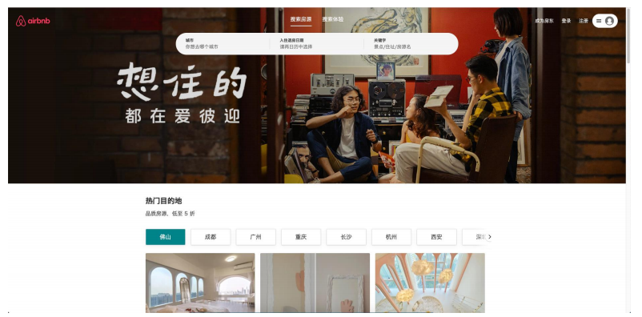

# **React全家桶 - 爱彼迎项目实战**

## 项目介绍

**项目核心学习、掌握的知识点：**

- 技术栈：React18, React Router, ReduxToolKit(RTK), axios, AntDesign, Material

  UI, styled-components, Jenkins, Nginx

- 对于第一个React项目，我们的核心是对前面所学知识进行练习、实战；

- 掌握React开发的流程、模式、项目架构，项目中会有很多组件、工具等封装、抽取、复用思想；

- 最重要的是学习React开发的模式和编程的思想，而不是局限于我上课期间所讲的内容，并且大部分样式和布局内容需要大家课程自行完成；

- 在这个项目过程中，我会尽量将之前所学的所有知识都运用起来，但是我们不会为了用某个知识而用某个知识；

- 课程中会使用我服务器已经获取到的数据，一是国内的数据更好看，二是担心它数据有一天不再维护，三是我对数据已经进行了大量的整理；

- 后续我们还会专门学习React+TypeScript项目实战的内容，React本身非常的灵活，对JavaScript本身要求也较高，但是最重要的还是练习；

## **项目规范**

**项目规范：项目中有一些开发规范和代码风格**

1. 文件夹、文件名称统一小写、多个单词以连接符（-）连接；

2. JavaScript变量名称采用小驼峰标识，常量全部使用大写字母，组件采用大驼峰；

3. CSS采用普通CSS和styled-component结合来编写（全局采用普通CSS、局部采用styled-component）;

4. 整个项目不再使用class组件，统一使用函数式组件，并且全面拥抱Hooks；

5. 所有的函数式组件，为了避免不必要的渲染，全部使用memo进行包裹；

6. 组件内部的状态，使用useState、useReducer；业务数据全部放在redux中管理；

7. 函数组件内部基本按照如下顺序编写代码：

- 组件内部state管理；

- redux的hooks代码；

- 其他hooks相关代码（比如自定义hooks）；

- 其他逻辑代码；
- 返回JSX代码；

8. redux代码规范如下：

- redux目前我们学习了两种模式（传统模式和reduxtookit），在项目实战中尽量两个都用起来，都需要掌握；

- 每个模块有自己独立的reducer或者slice，之后合并在一起；
- redux中会存在共享的状态、从服务器获取到的数据状态；

9. 网络请求采用axios

- 对axios进行二次封装；

- 所有的模块请求会放到一个请求文件中单独管理；

10. 项目使用AntDesign、MUI（Material UI）

- 爱彼迎本身的设计风格更多偏向于Material UI，但是课程中也会尽量讲到AntDesign的使用方法；

- 项目中某些AntDesign、MUI中的组件会被拿过来使用；

- 但是多部分组件还是自己进行编写、封装、实现；

- 其他规范在项目中根据实际情况决定和编写；
